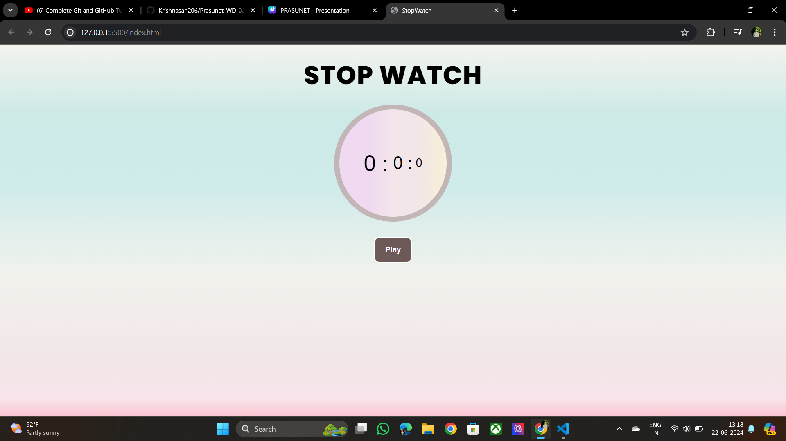
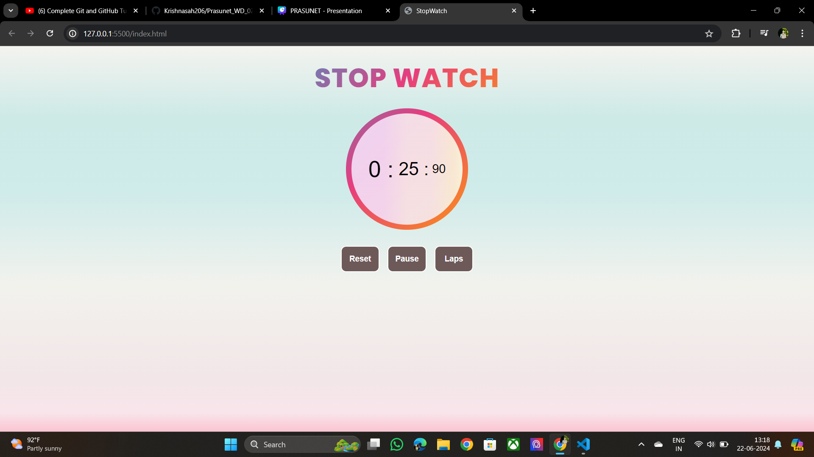
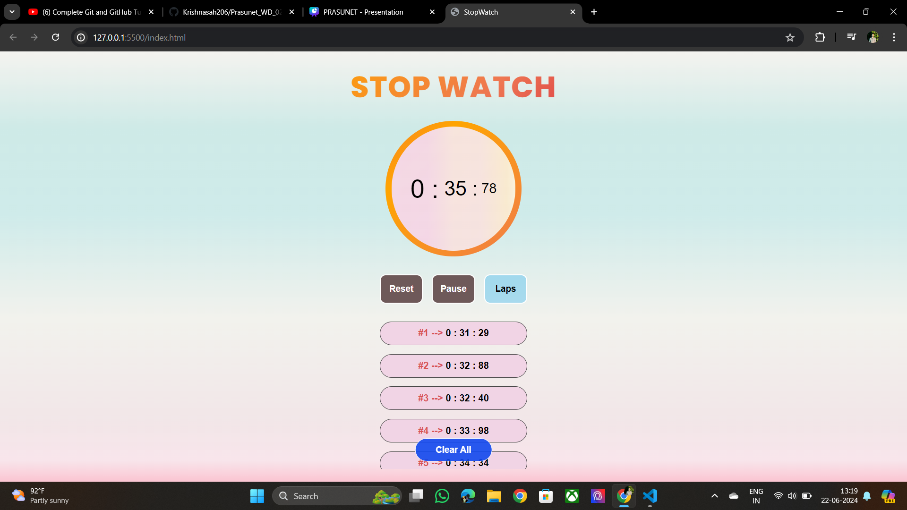

# Stopwatch Project

This project is a simple stopwatch application built using HTML, CSS, and JavaScript. It is designed as part of Task 2 for the Prasunet company internship in web designing. The stopwatch allows users to start, reset the timer, and record laps. It displays the elapsed time in hours, minutes, seconds, and milliseconds.

## Features

- **Start:** Begins the stopwatch, counting up from zero.
- **Reset**: Stops the stopwatch and resets the elapsed time to zero.
- **Laps**: Records the current time as a lap and displays it in a list.

## Technologies Used

- **HTML**: Provides the structure of the stopwatch application.
- **CSS**: Used for styling the application, ensuring it is visually appealing and user-friendly.
- **JavaScript**: Implements the logic for the stopwatch functionality, including time calculation, event handling, and lap recording.

## Project Structure

- **index.html**: The main HTML file containing the structure of the stopwatch, including buttons for starting, resetting, and recording laps, as well as a display area for showing the elapsed time and a section for displaying laps.
- **styles.css**: The CSS file containing the styling rules for the stopwatch, ensuring it has a clean and modern appearance.
- **script.js**: The JavaScript file containing the logic for the stopwatch functionality, including handling start, reset, and lap recording actions, and updating the display.

## Usage

1. **Start the Stopwatch**: Click the "Start" button to begin the timer. The button toggles between starting and stopping the timer.
2. **Reset the Stopwatch**: Click the "Reset" button to stop the timer and reset the elapsed time to zero.
3. **Record Laps**: Click the "Laps" button to record the current time and add it to the lap list. The laps are displayed in a list below the stopwatch.

## How It Works

- **Start Button**: When the "Start" button is clicked, the stopwatch starts counting up from zero. Clicking the button again will pause the stopwatch.
- **Reset Button**: The "Reset" button stops the stopwatch and resets the elapsed time to zero. It also clears the list of recorded laps.
- **Laps Button**: Clicking the "Laps" button records the current elapsed time as a lap and adds it to a list of laps displayed below the stopwatch. This allows users to keep track of multiple lap times without resetting the stopwatch.

This project demonstrates the basics of creating a functional stopwatch using HTML, CSS, and JavaScript. It can be extended with additional features and enhancements as needed.

